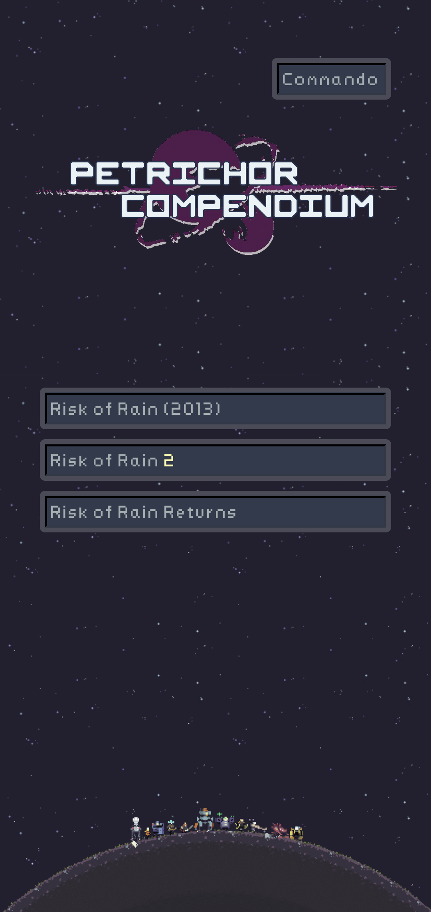
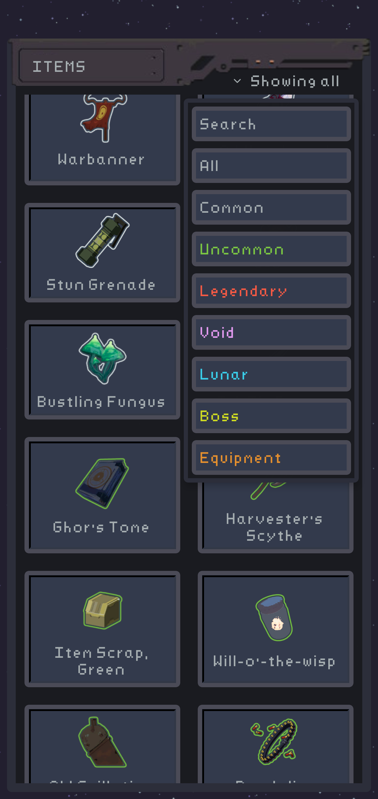
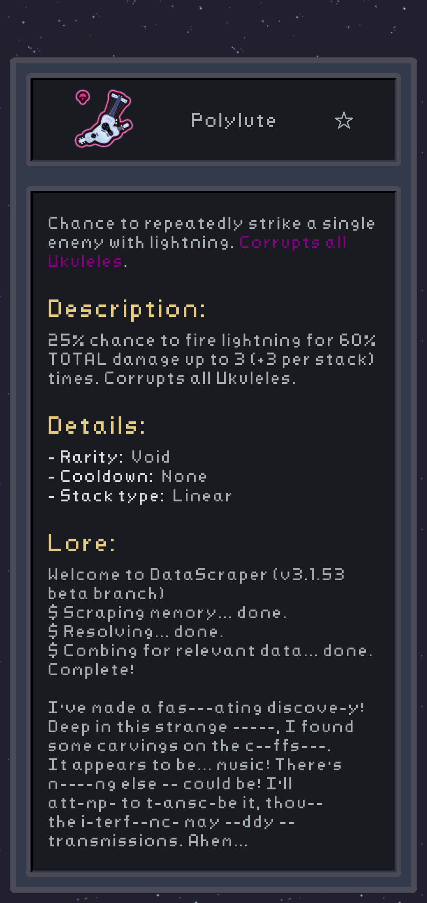

### A wiki for Risk of Rain 1/2/Returns written in React Native

---

Mobile app for checking item descriptions, stats and lore for all items in Risk of Rain, Risk of Rain 2 and Risk of Rain Returns, including a search function and filtering by item rarity.

### Screenshots:

  
  
  
  

### Resources:
Item data for this app was gathered from the following sources:
- ROR1: [risk-of-rain-cheatsheet](https://github.com/Nickardson/risk-of-rain-cheatsheet)
- RORR: [rorrcheatsheet](https://github.com/SeeJaeey/rorrcheatsheet/tree/main) / Ingame files
- ROR2: [riskofrain2api](http://riskofrain2api.herokuapp.com/) / Ingame files

Thanks!!

Missing images sourced from the oficial wikis for [ROR2](https://riskofrain2.wiki.gg) and [RORR](https://riskofrainreturns.wiki.gg)
Background GIF by [omega on Steam](https://steamcommunity.com/sharedfiles/filedetails/?id=2433014459)

### Libraries:
For a list of used libraries, check out [package.json](https://github.com/mthuss/petrichor-compendium/blob/main/package.json)
